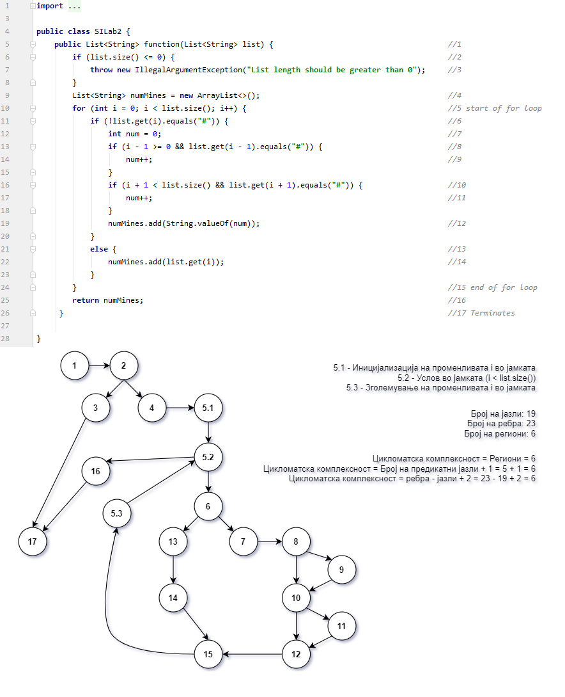

# Втора лабораториска вежба по Софтверско инженерство
# Грета Митовска, бр на индекс 173007
# Група на код:
Ја добив групата на код 5.
# Control Flow Graph

# Цикломаткса комплексност
Цикломатската комплексност на овој код е 6, пресметана е според формулата P + 1, (P = број на предикатни јазли). Во овој случај P = 5, па затоа цикломатската комплексност изнесува 6.
# Тест случаи според критериумот Every Statement
Тест случај 1) list = null ---> Јазли: 1, 2, 3, 17

Тест случај ) list = {#, 0, #} ---> Јазли: 1, 2, 4, 5.1, 5.2, 6, 7, 8, 9, 10, 11, 12, 13, 14, 15, 5.3, 16, 17

Првиот случај ќе фрли exception, а вториот случај поради for јамката ќе ги покрие сите останати јазли. 
# Тест случаи според критериумот Every Path
1, 2, 3, 17

1, 2, 4, 5.1, 5.2, 16, 17 - не може поради проверката list.size()

1, 2, 4, 5.1, 5.2, (6, 13, 14, 15, 5.3, 5.2), 16, 17

1, 2, 4, 5.1, 5.2, (6, 7, 8, 9, 10, 11, 12, 15, 5.3, 5.2), 16, 17

1, 2, 4, 5.1, 5.2, (6, 7, 8, 10, 12, 15, 5.3, 5.2), 16, 17

1, 2, 4, 5.1, 5.2, (6, 7, 8, 9, 10, 12, 5.3, 5.2), 16, 17

1, 2, 4, 5.1, 5.2, (6, 7, 8, 10, 11, 12, 15, 5.3, 5.2), 16, 17

